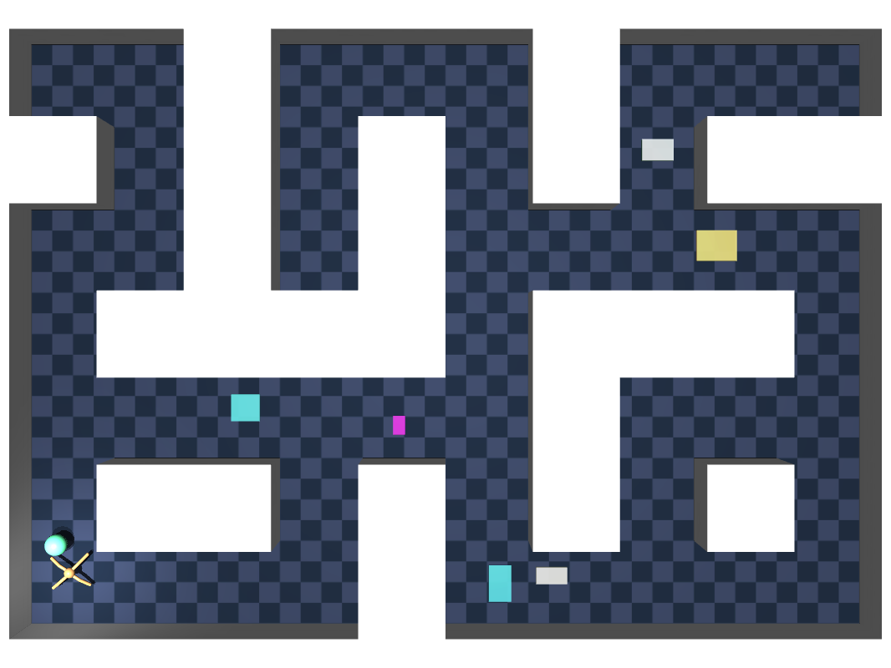

<div align="center" style="margin: 20px 0px;">
    
</div>

<div align="center" style="margin-bottom: 20px">
    
    
</div>

# OGBench-TL: Benchmarking Offline Goal-Conditioned RL with Temporal Logic Tasks Visualization Enhancements

<p align="center">
    
</p>

## Overview

OGBench-TL is a **visualization-enhanced** version of [OGBench](https://github.com/seohongpark/ogbench) that maintains full compatibility with the original benchmark while adding specialized **Temporal Logic (TL) task visualization capabilities**. 

**Important Note**: The core tasks, datasets, and environment logic remain **unchanged** from the original OGBench. This library focuses exclusively on **enhancing visualization** for temporal logic task analysis and debugging, without modifying the underlying task definitions or dataset structure.

The key visualization enhancements include:
- **Temporal Logic Region Marking**: Visual representation of regions defined by temporal logic specifications
- **Waypoint Indicators**: Dynamic visualization of subgoals and waypoints for hierarchical planning
- **Customizable Background**: Optional white background for cleaner visualization
- **Simplified Goal Visualization**: Original goal/target markers removed as TL tasks can explicitly represent endpoints

<p align="center" style="margin-top: 1.5rem;">
    
</p>
<p align="center">
    <em>Temporal Logic task visualization example with <strong>blue circular waypoints</strong> and <strong>rectangular labeled regions</strong></em>
</p>

## Features

### Core Features (inherited from OGBench)
- 8 types of realistic and diverse environments:
  - **Locomotion**: PointMaze, AntMaze, HumanoidMaze, and AntSoccer
  - **Manipulation**: Cube, Scene, and Puzzle  
  - **Drawing**: Powderworld
- 85 datasets covering various challenges in offline goal-conditioned RL
- 410 tasks for standard (i.e., non-goal-conditioned) offline RL
- Support for both pixel-based and state-based observations
- Clean, well-tuned reference implementations of 6 offline goal-conditioned RL algorithms
- Fully reproducible scripts for benchmarking and dataset generation
- `pip`-installable, easy-to-use APIs based on Gymnasium
- No major dependencies other than MuJoCo

### Temporal Logic Visualization Enhancements
- **Region Visualization**: Circular and rectangular regions with customizable colors and positions
- **Waypoint Indicators**: Real-time subgoal visualization with customizable color coding
- **White Background**: Optional clean background for improved visual clarity
- **Dynamic Region Management**: Runtime addition and removal of regions
- **Simplified Goal Display**: Original goal markers removed (TL tasks explicitly represent endpoints)

**Note**: All visualization features are purely additive and do not modify underlying tasks, rewards, or dataset structure.

## Installation

OGBench-TL can be installed directly from source:

```bash
git clone https://github.com/Pr0ximah/ogbenchTL.git
cd ogbenchTL
pip install -e .
```

It requires Python 3.8+ and has only three dependencies: `mujoco >= 3.1.6`, `dm_control >= 1.0.20`, and `gymnasium`.

## Usage for Temporal Logic Tasks

### Creating Environments

> [!CAUTION]
> Use `ogbenchTL.make_env_and_datasets` instead of `gymnasium.make`. For environment-only creation, set `env_only=True`.

Create environments with TL visualization support:

```python
import ogbenchTL

env, train_dataset, val_dataset = ogbenchTL.make_env_and_datasets(
    'antmaze-large-navigate-v0',
    region_type='circle',          # or 'rect' for rectangular regions  
    max_regions=5,                 # maximum number of regions to visualize
    white_bg=True,                 # enable white background
    wp_indicator=True              # enable waypoint indicators
)
```

> [!NOTE]
> Temporal Logic visualization is **purely visual** and does not affect the underlying task logic or reward structure.
> 
> * The original goal/target markers have been **removed** since TL tasks can explicitly represent endpoints through regions and waypoints
> * Setting `max_regions=0`, `wp_indicator=False`, and `white_bg=False` makes the environment behave exactly like the original OGBench but no goal/target markers will be shown.
> * Region type must be consistent throughout the environment lifetime - dynamic switching between circle and rectangle regions is not supported
> * The total number of regions cannot exceed the `max_regions` value specified during environment creation

> [!CAUTION]
> When using `ogbenchTL.make_env_and_datasets`, access region methods through `env.unwrapped` (e.g., `env.unwrapped.add_region()`).
> Direct access like `env.add_region()` may not work due to environment wrappers.

### Adding Temporal Logic Regions

Once you have an environment instance, you can dynamically add regions:

```python
# Add a circular region
region1 = {
    'shape': 'circle',
    'center': [5.0, 3.0],          # (x, y) coordinates
    'radius': 1.5,
    'color': [1.0, 0.0, 0.0, 0.7]  # RGBA color (red with transparency)
}
env.unwrapped.add_region(region1)

# Add a rectangular region  
region2 = {
    'shape': 'rect',
    'center': [8.0, 6.0],
    'size': [2.0, 3.0],            # width, height
    'color': [0.0, 1.0, 0.0, 0.7]  # green with transparency
}
env.unwrapped.add_region(region2)
```

### Setting Waypoint Indicators

Visualize waypoints and subgoals:

```python
# Default color (green-blue for subgoals)
env.unwrapped.set_wp_indicator([4.0, 7.0])

# Custom color (e.g., red for final goals)
env.unwrapped.set_wp_indicator([10.0, 2.0], wp_color=[1.0, 0.4, 0.4, 1.0])
```

> [!NOTE]
> Default waypoint color: `[0.4, 1.0, 0.7, 1.0]` (green-blue)
> Use `env.unwrapped.reset_wp_indicator()` to hide the waypoint indicator

### Complete Example

```python
import ogbenchTL
import numpy as np

# Create environment with TL visualization
env, train_dataset, val_dataset = ogbenchTL.make_env_and_datasets(
    'antmaze-large-navigate-v0',
    region_type='circle',
    max_regions=3,
    white_bg=True,
    wp_indicator=True
)

# Define regions
regions = [
    {'shape': 'circle', 'center': [3.0, 2.0], 'radius': 1.2, 'color': [1.0, 0.0, 0.0, 0.7]},
    {'shape': 'circle', 'center': [8.0, 5.0], 'radius': 1.5, 'color': [0.0, 0.0, 1.0, 0.7]},
    # Note: All regions must be circles since region_type='circle'
]

# Add regions
for region in regions:
    env.unwrapped.add_region(region)

# env.unwrapped.clear_regions()  # Example of clearing all regions

# Set a waypoint indicator with default color
env.unwrapped.set_wp_indicator([7.0, 4.0])

# Reset environment with specific task
ob, info = env.reset(options={'task_id': 1})

# Render the environment to see regions and waypoints
frame = env.render()

# Step through environment
done = False
while not done:
    action = env.action_space.sample()
    ob, reward, terminated, truncated, info = env.step(action)
    done = terminated or truncated
    frame = env.render()  # Visualize current state with regions and waypoints
```

## Environment Structure

### Locomotion Environments with TL Support
- `PointMaze`: Simple point mass navigation with TL region marking
- `AntMaze`: Ant robot navigation with complex terrain and TL visualization  
- `HumanoidMaze`: Humanoid robot navigation with full-body dynamics and TL support
- `AntSoccer`: Ant robot soccer environment (TL features planned)

### Manipulation Environments (Planned TL Integration)
The manipulation environments (`Cube`, `Scene`, `Puzzle`) are planned for future TL feature integration, following the same visualization patterns established in the locomotion environments.

## Planned Features

- **Manipulation Environment TL Integration**: Extend temporal logic visualization to manipulation environments  
- **Multi-agent Components**: Add support for multi-agent temporal logic coordination tasks and visualization
- **Complex Region Shapes**: Support for polygonal and custom-shaped regions

## More documentation

Please refer to the original [OGBench Repo](https://github.com/seohongpark/ogbench) for more detailed documentation on core functionalities, algorithms, and dataset generation.

## Acknowledgments

This is a **pure visualization enhancement** of [OGBench](https://github.com/seohongpark/ogbench). Core tasks, datasets, and environment logic remain unchanged.

This library inherits code from:
- [D4RL](https://github.com/Farama-Foundation/D4RL) for dataset structure and AntMaze environment
- [Gymnasium](https://github.com/Farama-Foundation/Gymnasium) and [dm_control](https://github.com/google-deepmind/dm_control) for locomotion agents  
- [MuJoCo Menagerie](https://github.com/google-deepmind/mujoco_menagerie) for robot descriptions
- [Meta-World](https://github.com/Farama-Foundation/Metaworld) for manipulation objects
- [Powderworld](https://github.com/kvfrans/powderworld) for the drawing environment

Special thanks to the original OGBench authors for providing an excellent foundation.

## Citation

If you use OGBench-TL in your research, please cite both the original OGBench paper and acknowledge this extension:

```bibtex
@inproceedings{ogbench_park2025,
  title={OGBench: Benchmarking Offline Goal-Conditioned RL},
  author={Park, Seohong and Frans, Kevin and Eysenbach, Benjamin and Levine, Sergey},
  booktitle={International Conference on Learning Representations (ICLR)},
  year={2025},
}
```

## License

MIT License - see [LICENSE](LICENSE) for details.
